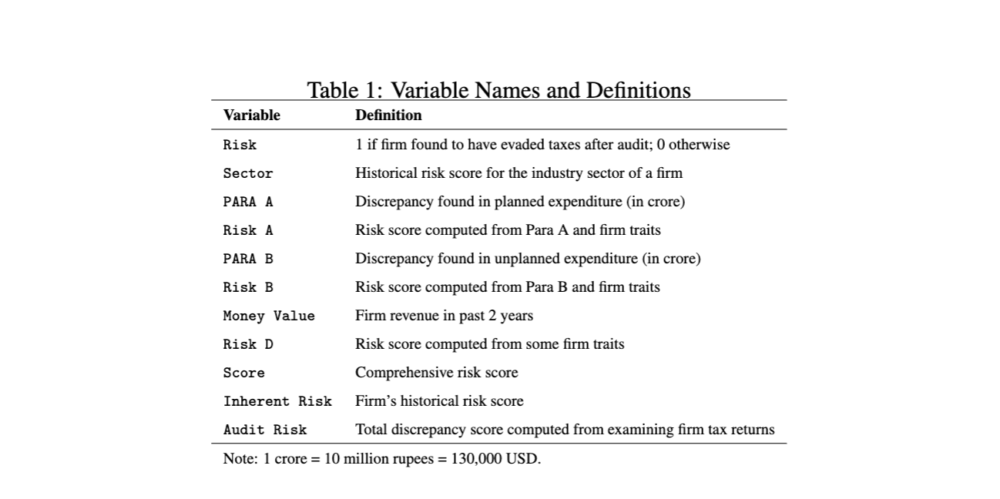

## Machine Learning Case Study - Tax Evasion Prediction

### 1.Project Idea

Governments can increase tax revenue by improving audit targeting---focusing audits on firms more likely to evade taxes while reducing audits of likely compliant firms. This improves detection without expanding audit resources. This project examines how machine learning--based risk prediction can help identify high-risk firms before audits occur.

### 2. Data

The project uses firm-level audit data from India, covering firms that were suspected of tax evasion and subsequently audited by the Comptroller and Auditor General (CAG) of India.

The dataset includes firms selected into the audit process based on government suspicion, rather than a random sample of all firms. The outcome variable indicates whether the audit ultimately found evidence of tax evasion (Risk). The predictors consist of multiple quantitative measures describing firm characteristics, financial activity, and risk-related indicators.

The dataset has been slightly modified for instructional purposes, with simplified definitions for some variables. Table 1 provides the full list of variables and their definitions.

> {width="4.641732283464567in" height="2.3172900262467193in"}

### 3. Methodology

The project applies supervised machine learning methods to predict the likelihood that a firm will be found to have evaded taxes in an audit.

The analysis treats tax evasion detection as a binary classification problem, using firm-level characteristics and risk indicators as predictors. Two model classes are implemented. First, a logistic regression model serves as an interpretable baseline. Second, a K-Nearest Neighbors (KNN) classifier provides a flexible, non-parametric alternative capable of capturing nonlinear relationships and interactions without explicit specification.

Model performance is evaluated using out-of-sample testing and cross-validation. Multiple models are compared to assess predictive performance and robustness, that is, whether results remain stable across alternative model specifications, validation strategies, and classification thresholds. Particular attention is given to the trade-off between false negatives (missed evaders) and false positives (unnecessary audits).

### 4. Results

To compare model performance consistently, Table 2 presents the confusion matrices and overall accuracy for all four models.

**Confusion Matrix Comparison**

  -------------------------------------------------------------------------------
  **Model**        **TN**      **FP**      **FN**      **TP**      **Accuracy**
  ---------------- ----------- ----------- ----------- ----------- --------------
  Logistic (0.5)   232         3           3           150         98.97%

  Logistic (0.6)   235         0           3           150         99.23%

  KNN (Unscaled)   231         4           15          138         95.10%

  KNN (Scaled)     230         5           9           144         96.39%
  -------------------------------------------------------------------------------

**Model Comparisons**

1.  Logistic Regression vs. KNN

Both logistic regression models substantially outperform the KNN models in overall accuracy and error rates. Logistic regression achieves approximately 99% accuracy, while KNN ranges between 95% and 96%.

More importantly, logistic regression produces far fewer false negatives. In contrast, the unscaled KNN misses 15 evaders and the scaled KNN misses 9. Given that missed evaders directly reduce tax revenue, this difference is policy-relevant.

The ROC curve for logistic regression yields an AUC of approximately 0.999, indicating near-perfect discrimination within the audited sample.

> {width="4.0671052055993in" height="3.7388834208223973in"}

2.  Threshold Choice in Logistic Regression

Model performance is not highly sensitive to the classification threshold. Adjusting the threshold mainly shifts the trade-off between false positives and false negatives, while overall accuracy remains very stable. This suggests the logistic model is robust to this hyperparameter choice.

3.  Scaled vs. Unscaled KNN

Scaling improves KNN performance. The scaled model reduces missed evaders from 15 to 9 and increases overall accuracy. This reflects the importance of standardizing predictors in distance-based methods, since unscaled variables with larger numerical ranges can distort neighborhood calculations.

**Conclusion**

Among the models tested, logistic regression outperforms KNN, achieving higher accuracy and fewer missed evaders. Its performance is also stable across thresholds, indicating robustness. The strong results likely reflect a structured relationship between observable risk indicators and audit outcomes in this selected sample, where logistic regression performs well.

While logistic regression is the best performer here, future work could explore more flexible models such as tree-based methods. A key limitation is the restricted dataset: it includes only pre-selected audited firms, which may limit generalizability and make prediction easier than in the full firm population.
