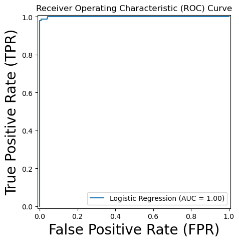

## Machine Learning Case Study - Tax Evasion Prediction

### 1.Project Idea

Governments can increase tax revenue by improving audit targeting, that is, focusing audits on firms more likely to evade taxes while reducing audits of likely compliant firms. This improves detection without expanding audit resources. This project examines how machine learning based risk prediction can help identify high-risk firms before audits occur.

### 2. Data

The project uses firm-level audit data from India, covering firms suspected of tax evasion and subsequently audited by the Comptroller and Auditor General (CAG) of India.

The dataset consists of firms selected for audit based on government suspicion rather than a random sample of the full firm population. The outcome variable indicates whether the audit detected tax evasion (`Risk`). Predictors include multiple quantitative measures capturing firm characteristics, financial activity, and risk-related indicators.

The dataset has been modified for instructional use. Certain variable definitions have been simplified while preserving the underlying structure of the audit context. Table 1 below presents the full list of variables and their definitions.

  

### 3. Methodology

This project applies supervised machine learning methods to estimate the probability that an audited firm will be found to have evaded taxes.

Tax evasion detection is framed as a binary classification problem, using firm-level characteristics and risk indicators as predictors. Two model classes are implemented. Logistic regression serves as an interpretable baseline model. K-Nearest Neighbors (KNN) provides a flexible, non-parametric alternative capable of capturing nonlinear patterns without imposing a specific functional form.

Model performance is evaluated using out-of-sample test data and cross-validation. Models are compared to assess predictive accuracy and robustness across alternative specifications, validation strategies, and classification thresholds. Particular attention is given to the trade-off between false negatives (missed evaders) and false positives (unnecessary audits), reflecting enforcement priorities.

### 4. Results

To compare model performance consistently, Table 2 presents the confusion matrices and overall accuracy for all four models.

**Confusion Matrix Comparison**

| Model          | TN  | FP  | FN  | TP  | Accuracy |
| -------------- | --- | --- | --- | --- | -------- |
| Logistic (0.5) | 232 | 3   | 3   | 150 | 98.97%   |
| Logistic (0.6) | 235 | 0   | 3   | 150 | 99.23%   |
| KNN (Unscaled) | 231 | 4   | 15  | 138 | 95.10%   |
| KNN (Scaled)   | 230 | 5   | 9   | 144 | 96.39%   |

**Model Comparisons**

Logistic Regression vs. KNN

Both logistic regression models substantially outperform the KNN models in overall accuracy and error rates. Logistic regression achieves approximately 99% accuracy, while KNN ranges between 95% and 96%.

More importantly, logistic regression produces far fewer false negatives. In contrast, the unscaled KNN misses 15 evaders and the scaled KNN misses 9. Given that missed evaders directly reduce tax revenue, this difference is policy-relevant.

The ROC curve for logistic regression yields an AUC of approximately 0.999, indicating near-perfect discrimination within the audited sample.

  

**Conclusion**

Among the models tested, logistic regression outperforms KNN, achieving higher accuracy and fewer missed evaders. Its performance is also stable across thresholds, indicating robustness. The strong results likely reflect a structured relationship between observable risk indicators and audit outcomes in this selected sample, where logistic regression performs well.

While logistic regression is the best performer here, future work could explore more flexible models such as tree-based methods. A key limitation is the restricted dataset: it includes only pre-selected audited firms, which may limit generalizability and make prediction easier than in the full firm population.

## Appendices

This repository is organized into structured appendices for clarity and reproducibility:

- **Appendix A – Data**  
	  Contains the processed dataset used in this analysis.

- **Appendix B – Code**  
	  Contains the full Jupyter notebook implementing preprocessing, modeling, and evaluation.

- **Appendix C – Result Details**  
	  Contains extended performance tables, ROC analysis, threshold sensitivity, limitations, and future work.